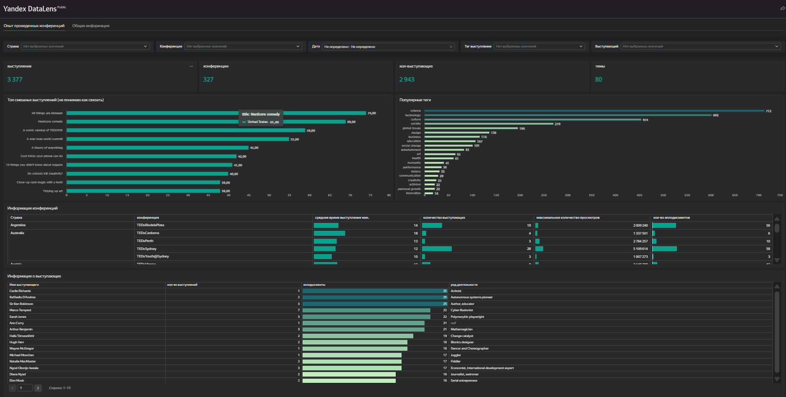
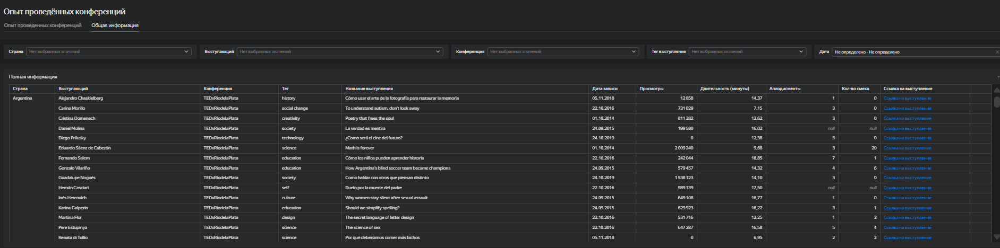

# DataLens-дашборд: анализ опыта проведённых TED-конференций

## Описание проекта

Учебный проект по визуализации данных в Yandex DataLens. Дашборд разработан для компании, которая приобрела лицензию на проведение TED-конференции и хочет изучить опыт уже проведённых мероприятий: популярные темы, реакцию зрителей, длительность выступлений, активность спикеров и характеристики конференций.

## Бизнес-задача

Заказчику нужно понять, как организовать первое мероприятие в духе классических TED-конференций:

- какие темы и теги чаще встречаются на конференциях;
- какие выступления вызывают сильную реакцию аудитории;
- сколько спикеров обычно участвует в конференциях;
- какая средняя длительность выступлений;
- какие спикеры и темы наиболее интересны зрителям;
- как сравниваются конференции по просмотрам, аплодисментам и количеству выступающих.

## Данные

Использовалась учебная база данных с тремя таблицами:

- `events` — информация о конференциях;
- `speakers` — информация о выступающих;
- `talks` — информация о выступлениях, просмотрах, длительности, тегах и реакции аудитории.

Данные не публикуются в репозитории, так как использовались в учебной среде.

## Что было сделано

- Подключены данные о конференциях, спикерах и выступлениях.
- Настроены связи между таблицами конференций, выступающих и выступлений.
- Создан дашборд с двумя вкладками:
  - обзор опыта проведённых конференций;
  - общая детальная таблица по выступлениям.
- Добавлены селекторы для анализа данных по стране, конференции, дате, тегу и выступающему.
- Построены верхнеуровневые KPI:
  - количество выступлений;
  - количество конференций;
  - количество выступающих;
  - количество тем.
- Визуализированы топ смешных выступлений и популярные теги.
- Добавлены таблицы с информацией по конференциям и выступающим.
- Настроена детальная таблица с названием выступления, датой, просмотрами, длительностью, аплодисментами, смехом и ссылкой на выступление.

## Основные показатели на дашборде

- Выступления: 3 377
- Конференции: 327
- Уникальные выступающие: 2 943
- Темы / теги: 80

## Использованные визуализации

- KPI-карточки;
- горизонтальные bar chart для топа выступлений;
- горизонтальные bar chart для популярных тегов;
- таблицы с условным форматированием;
- фильтры и селекторы;
- детальная таблица с ссылками на выступления.

## Дашборд
[Открыть дашборд в Yandex DataLens](https://datalens.yandex/u6pqpmiqu7uef?_no_controls=1)
## Скриншоты Дашборда

### Обзорная вкладка дашборда

### Детальная вкладка дашборда

## Вывод

Дашборд помогает быстро изучить опыт проведённых TED-конференций: оценить масштаб данных, определить популярные темы, увидеть выступления с наибольшей реакцией аудитории, сравнить конференции по просмотрам и вовлечённости, а также перейти к детальной информации по каждому выступлению.

## Инструменты

Yandex DataLens, SQL, визуализация данных, построение дашбордов.
