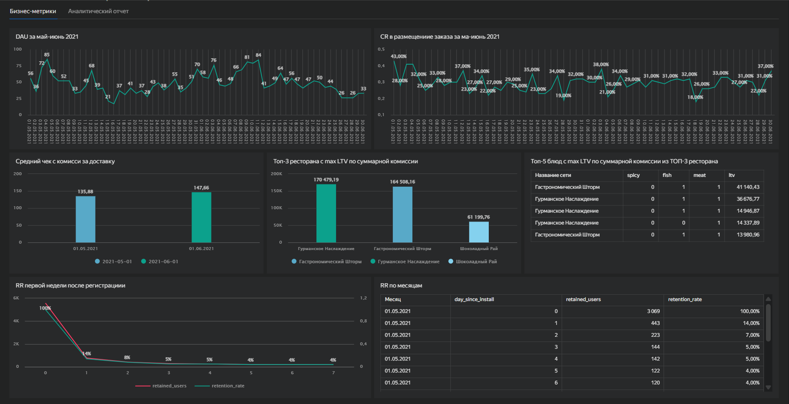

# DataLens-дашборд: ключевые бизнес-метрики сервиса доставки еды

## Описание проекта

Учебный проект по анализу сервиса доставки еды «Всё.из.кафе» в Саранске за период **1 мая — 30 июня 2021 года**. Задача — оценить ключевые продуктовые и финансовые метрики, выявить проблемы роста и подготовить рекомендации для бизнеса.

## Бизнес-задача

Оценить состояние сервиса доставки по метрикам активности, конверсии, удержания и монетизации, чтобы понять, где находится главный ограничитель роста: в привлечении, конверсии, удержании или партнёрской базе.

## Что было сделано

- Рассчитан **DAU** по дням.
- Проанализирована **конверсия в заказ (CR)**.
- Рассчитан средний чек по комиссии с заказа.
- Построен анализ **Retention Rate** первой недели после регистрации.
- Рассчитан LTV по ресторанам и блюдам через сумму комиссии.
- Подготовлены выводы, риски и рекомендации для бизнеса.

## Ключевые выводы

- Средний DAU составил около **49 пользователей в день**.
- Средний CR в заказ — около **29,3%**.
- Day 1 Retention — **13,8%**, Day 7 Retention — около **3,7%**.
- Основная проблема бизнеса — слабое удержание новых пользователей при нормальной монетизации лояльной аудитории.
- Приоритетные рекомендации: улучшить онбординг, запустить приветственный бонус, исследовать причины оттока и масштабировать привлечение только после улучшения удержания.

## Инструменты

Yandex DataLens, SQL, PostgreSQL, продуктовая аналитика, Retention, DAU, CR, LTV, визуализация данных.

## Скриншоты дашборда

## Файлы проекта

- `dashboard_export_sanitized.json` — обезличенный экспорт DataLens без параметров подключения.
- `queries.sql` — SQL-запросы, использованные для расчёта метрик.
- `analytical_note.md` — аналитическая записка с выводами и рекомендациями.
- `screenshots/dashboard_business_metrics.png` — скриншот основной вкладки дашборда с бизнес-метриками.
