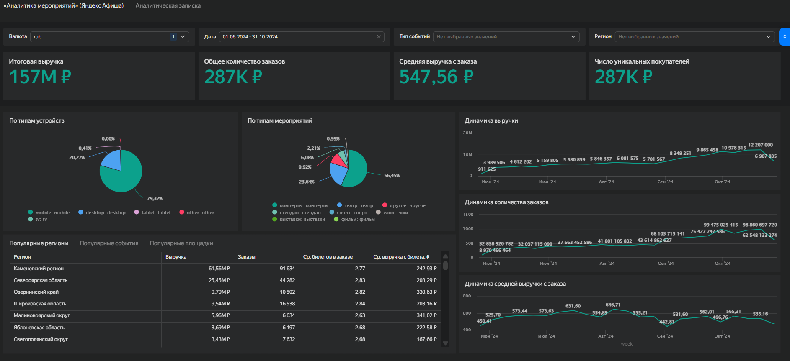
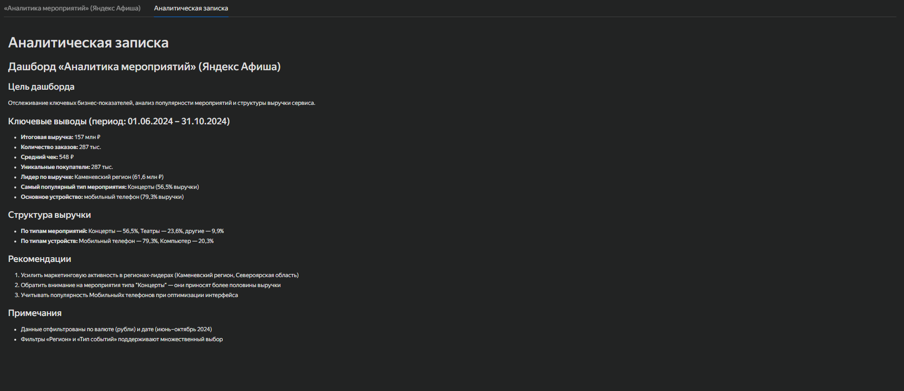

# DataLens-дашборд: аналитика мероприятий Яндекс Афиши

## Описание проекта

Учебный BI-проект по анализу продаж билетов и бизнес-показателей сервиса мероприятий. Дашборд помогает отслеживать выручку, количество заказов, среднюю выручку с заказа, число покупателей, структуру продаж по типам мероприятий, регионам, событиям, площадкам и устройствам.

## Бизнес-задача

Понять, какие регионы, типы мероприятий, устройства и площадки формируют основную выручку, как меняются ключевые показатели во времени и какие направления стоит усиливать через маркетинг и продуктовую оптимизацию.

## Дашборд

[Открыть дашборд в Yandex DataLens](https://datalens.yandex/mp036zz0n4xk6)

## Аналитическая записка

## Что было сделано

- Настроены фильтры по валюте, дате, типу события и региону.
- Сформированы KPI верхнего уровня: итоговая выручка, количество заказов, средняя выручка с заказа и число уникальных покупателей.
- Визуализирована динамика выручки, количества заказов и средней выручки с заказа.
- Проанализирована структура выручки по типам мероприятий и типам устройств.
- Выделены регионы, события и площадки с наибольшим вкладом в выручку.
- Подготовлена аналитическая записка с выводами и рекомендациями.

## Ключевые выводы

- Итоговая выручка за период составила около **157 млн ₽**.
- Количество заказов — около **287 тыс.**
- Средняя выручка с заказа — около **548 ₽**.
- Число уникальных покупателей — около **287 тыс.**
- Лидер по выручке — **Каменевский регион**: около **61,6 млн ₽**.
- Самый сильный тип мероприятий — **концерты**: около **56,5% выручки**.
- Основной канал по устройствам — **мобильный телефон**: около **79,3% выручки**.

## Рекомендации

1. Усилить маркетинговую активность в регионах-лидерах, в первую очередь в Каменевском регионе и Североярской области.
2. Развивать направление концертов, так как оно формирует более половины выручки.
3. Учитывать доминирование мобильных устройств при оптимизации пользовательского интерфейса и рекламных сценариев.

## Инструменты

Yandex DataLens, BI-дашборды, визуализация данных, расчёт KPI, анализ выручки, анализ продаж, аналитическая записка.

## Файлы проекта

- `dashboard_export_sanitized.json` — обезличенный экспорт DataLens без параметров подключения.
- `analytical_note.md` — аналитическая записка с выводами и рекомендациями.
- `screenshots/dashboard_overview.png` — скриншот основного дашборда.
- `screenshots/analytical_note.png` — скриншот аналитической записки.

## Примечание

Параметры подключения удалены или замаскированы перед публикацией проекта на GitHub.
