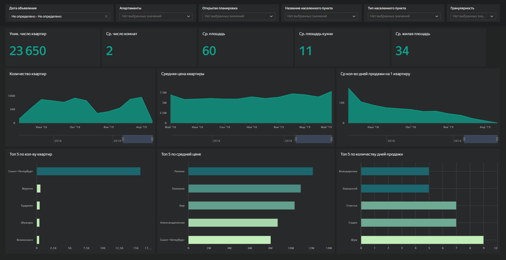
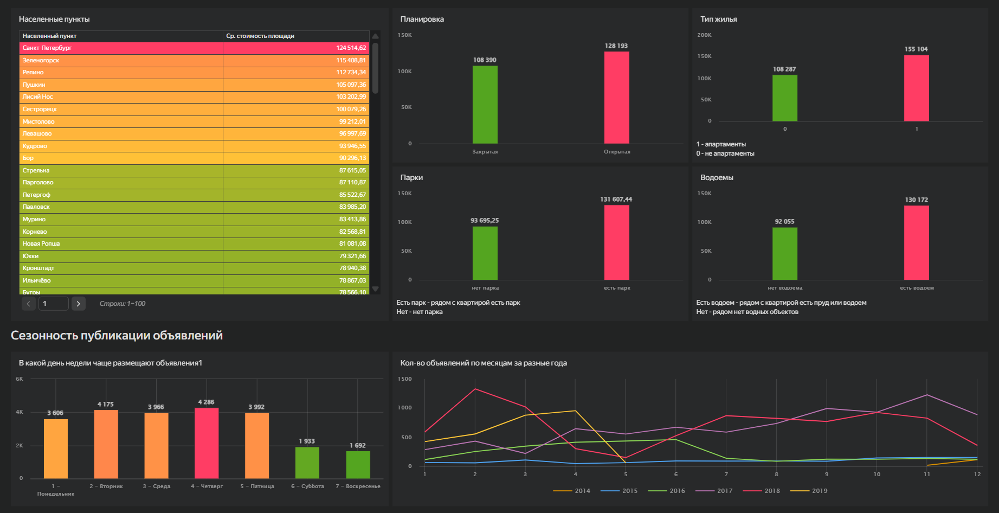

# DataLens-дашборд: аналитика рынка недвижимости

## Описание проекта

Учебный проект по визуализации данных рынка недвижимости в Yandex DataLens. Дашборд помогает анализировать объявления о продаже квартир: количество объектов, средние цены, стоимость квадратного метра, площадь, число комнат, кухню, планировку, апартаменты, близость парков/водоёмов и сезонность публикаций.

## Бизнес-задача

Создать интерактивный BI-дашборд для агентства недвижимости, чтобы быстро оценивать структуру рынка, сравнивать населённые пункты и характеристики объектов, отслеживать динамику цен и понимать, какие сегменты выглядят наиболее привлекательными для продвижения и работы с клиентами.

## Что было сделано

- Настроены KPI по количеству квартир, средней цене, средней площади, числу комнат, площади кухни и жилой площади.
- Созданы визуализации по населённым пунктам, средней стоимости квадратного метра и средней цене квартиры.
- Добавлены графики динамики количества объявлений, средней цены и среднего срока продажи.
- Реализованы фильтры по дате объявления, апартаментам, открытой планировке, населённому пункту, типу населённого пункта и гранулярности периода.
- Подготовлена детализация рынка по типу жилья, открытой планировке, наличию парков и водоёмов рядом с объектом.
- Добавлен блок сезонности публикации объявлений по дням недели и месяцам.
- Использованы расчётные поля DataLens для средних значений, ранжирования, даты, периода и топ-срезов.

## Ключевые элементы дашборда

- Уникальное количество квартир.
- Среднее число комнат.
- Средняя площадь, площадь кухни и жилая площадь.
- Топ-5 населённых пунктов по количеству квартир.
- Топ-5 населённых пунктов по средней цене.
- Топ-5 населённых пунктов по количеству дней продажи.
- Сравнение стоимости объектов с открытой и закрытой планировкой.
- Сравнение стоимости апартаментов и неапартаментов.
- Влияние близости парков и водоёмов на среднюю стоимость площади.
- Сезонность публикации объявлений по дням недели и месяцам.

## Дашборд

[Открыть дашборд в Yandex DataLens](https://datalens.yandex/p2xr54wiubv4a)
## Скриншоты

### Общий обзор дашборда

### Детализация и сезонность

## Инструменты

Yandex DataLens, BI-дашборды, визуализация данных, расчётные поля, фильтры, аналитика недвижимости.

## Файлы проекта

- `dashboard_export_sanitized.json` — обезличенный экспорт DataLens без параметров подключения.
- `queries.sql` — SQL-запросы, извлечённые из экспорта, если они использовались в чартах.
- `analytical_note.md` — текстовые элементы и подписи из дашборда.
- `screenshots/` — скриншоты дашборда для просмотра проекта без доступа к DataLens.

## Результат

Дашборд позволяет быстро оценивать структуру рынка недвижимости, сравнивать населённые пункты по цене и объёму предложений, отслеживать динамику и сезонность публикации объявлений, а также анализировать влияние характеристик объекта на стоимость.
